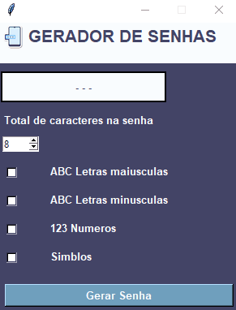

Aqui está um exemplo de README para o seu projeto de **Gerador de Senhas** usando Tkinter e Programação Orientada a Objetos. 

---

# Gerador de Senhas

Um aplicativo de interface gráfica (GUI) para geração de senhas, desenvolvido em Python com a biblioteca **Tkinter**. Este projeto é orientado a objetos e oferece uma interface intuitiva para configurar e criar senhas seguras, com opções personalizáveis de comprimento e tipos de caracteres.

## Índice

- [Funcionalidades](#funcionalidades)
- [Instalação](#instalação)
- [Uso](#uso)
- [Estrutura do Código](#estrutura-do-código)
- [Exemplo](#exemplo)
- [Contribuições](#contribuições)

## Funcionalidades

- **Seleção de Caracteres**: Escolha entre letras maiúsculas, minúsculas, números e símbolos para a composição da senha.
- **Definição de Comprimento**: Defina o comprimento desejado para a senha.
- **Geração de Senha**: Gera uma senha aleatória com base nas configurações escolhidas.
- **Cópia para a Área de Transferência**: Com um clique, copie a senha gerada para facilitar o uso imediato.
- **Interface Amigável**: Interface construída com Tkinter para fácil interação.

## Instalação

Certifique-se de ter o Python e a biblioteca Pillow instalados. Para instalar Pillow, use:

```bash
pip install pillow
```

Clone o repositório e navegue até o diretório do projeto:

```bash
git clone <URL_DO_REPOSITORIO>
cd gerador_de_senhas
```

## Uso

Execute o aplicativo com o seguinte comando:

```bash
python gerador_de_senhas.py
```

Na interface, você poderá:
1. Selecionar os tipos de caracteres para a senha (letras maiúsculas, minúsculas, números e símbolos).
2. Escolher o comprimento da senha.
3. Gerar uma nova senha aleatória com base nas configurações.
4. Copiar a senha gerada para a área de transferência.

## Estrutura do Código

O projeto foi implementado com **Programação Orientada a Objetos** para melhor organização e reutilização do código. Abaixo estão os principais componentes:

- **GeradorDeSenhasApp**: Classe principal que representa o aplicativo. Ela gerencia a criação da janela e os elementos da interface gráfica.
  - **configurar_janela**: Define o tamanho e posição da janela.
  - **criar_frames**: Cria os frames principais da interface.
  - **criar_widgets**: Configura os widgets (rótulos, botões, caixas de seleção).
  - **criar_senha**: Função responsável pela lógica de criação da senha.
  - **criar_botao_copiar**: Adiciona o botão para copiar a senha gerada para a área de transferência.

- **Funções de Geração de Senhas**:
  - **criar_senha**: Gera uma senha aleatória com base nos caracteres selecionados e no comprimento especificado pelo usuário.
  - **copiar_para_clipboard**: Função que copia a senha gerada para a área de transferência e exibe uma mensagem de confirmação.

## Exemplo



## Contribuições

Contribuições são bem-vindas! Sinta-se à vontade para abrir issues para sugestões ou relatórios de bugs, e envie um pull request para melhorias.

---
